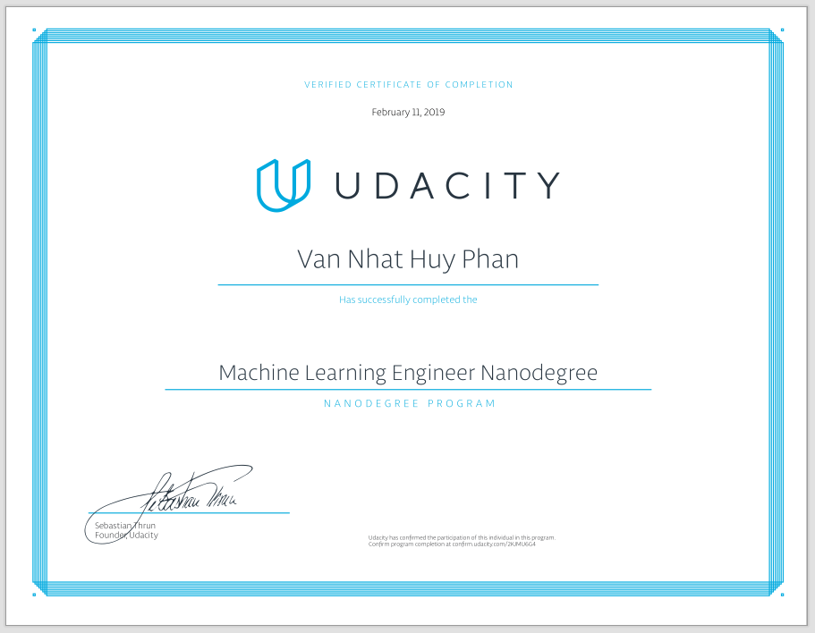
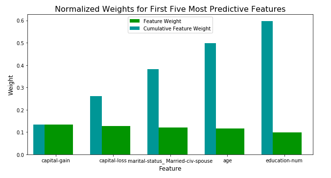
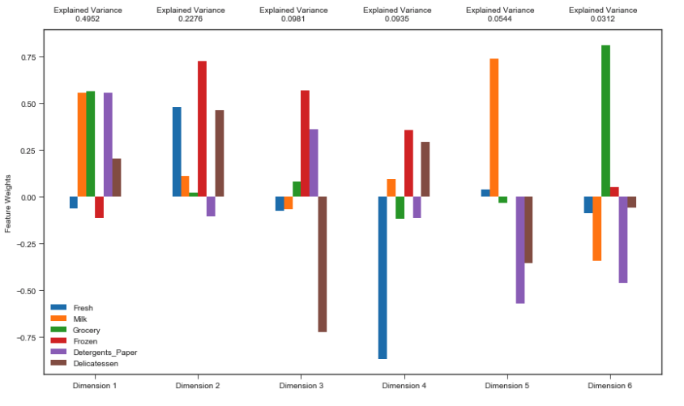
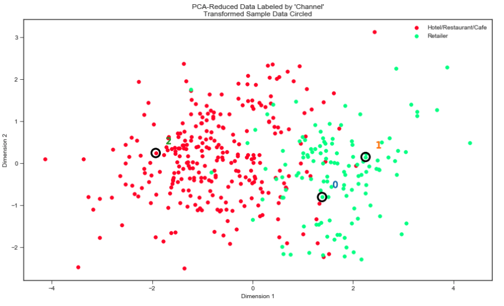
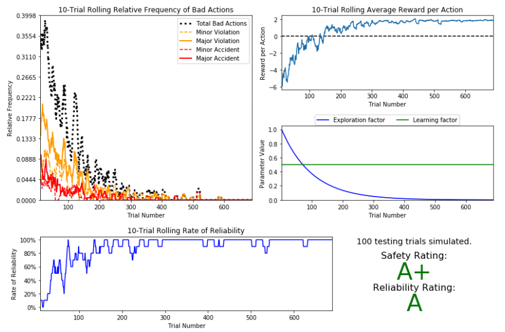
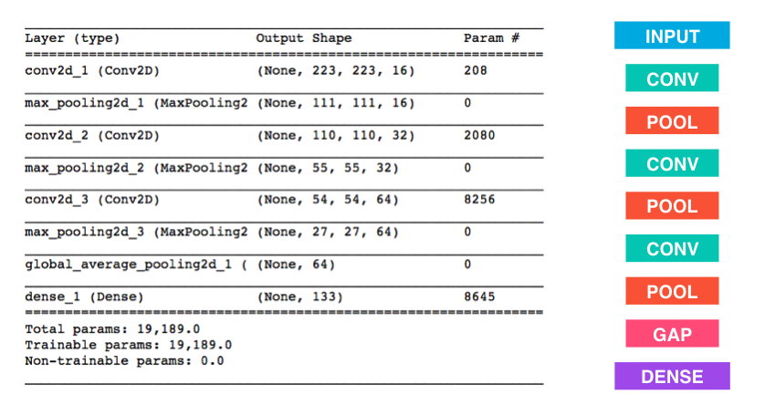
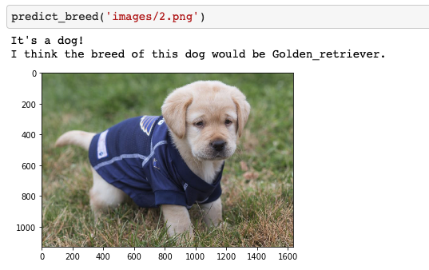
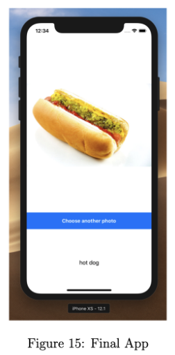
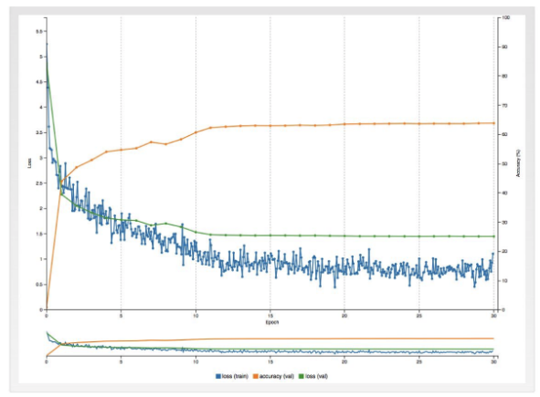

# Machine Learning Nanodegree's Projects

This is a repository to showcase all my projects in Udacity Machine Learning Nanodegree. There are a total of 6 projects in here.

## 1. Finding Donors for CharityML
- Developing Supervised Learning Models
-  In this project developed several supervised algorithms of your choice to accurately model individuals' income using data collected from the 1994 U.S. Census.

## 2. Predict Boston Housing Price
- Evaluating Models
- In this project I evaluated the performance and predictive power of a model that has been trained and tested on data collected from homes in suburbs of Boston, Massachusetts. 
- A model trained on this data that is seen as a good fit could then be used to make certain predictions about a home — in particular, its monetary value. This model would prove to be invaluable for someone like a real estate agent who could make use of such information on a daily basis.

## 3. Creating Customer Segments
- Developing Unsupervised Learning Models
- In this project I analyzed a dataset containing data on various customers' annual spending amounts (reported in monetary units) of diverse product categories for internal structure. 
- One goal of this project is to best describe the variation in the different types of customers that a wholesale distributor interacts with.
- Doing so would equip the distributor with insight into how to best structure their delivery service to meet the needs of each customer.

## 4. Training s SmartCab to Drive
- Reinforment Learning
- I worked towards constructing an optimized Q-Learning driving agent that will navigate a Smartcab through its environment towards a goal. 
- Since the Smartcab is expected to drive passengers from one location to another, the driving agent will be evaluated on two very important metrics: Safety and Reliability.

## 5. Deep Learning
- I made a program that take any user-supplied image as input. 
- If a dog is detected in the image, it will provide an estimate of the dog's breed. 
- If a human is detected, it will provide an estimate of the dog breed that is most resembling.

## 6. Deep Learning - iOS App Developing
- Created an iOS app to recognize food using deep learning to classify different kind of dishes.
- Used Food-101 dataset, rented Amazon EC2 instant to train model, used Caffe as deep learning framework,
- Made use of AlexNet, converted model to Apple CoreML, integrated CoreML model on iOS devices, evaluated model using real world data.

